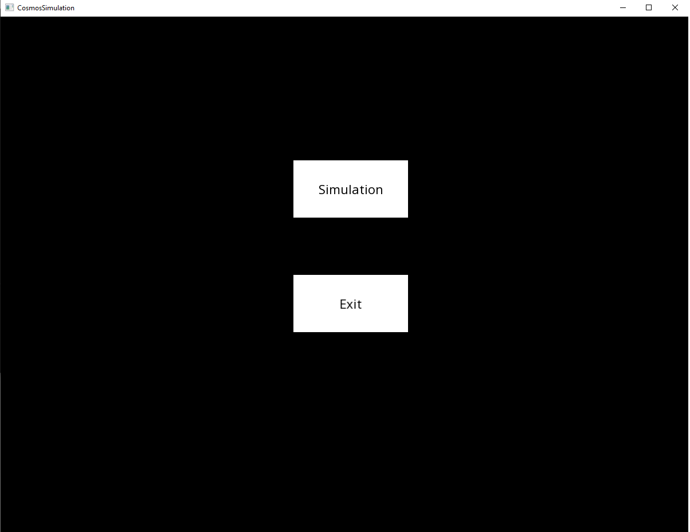
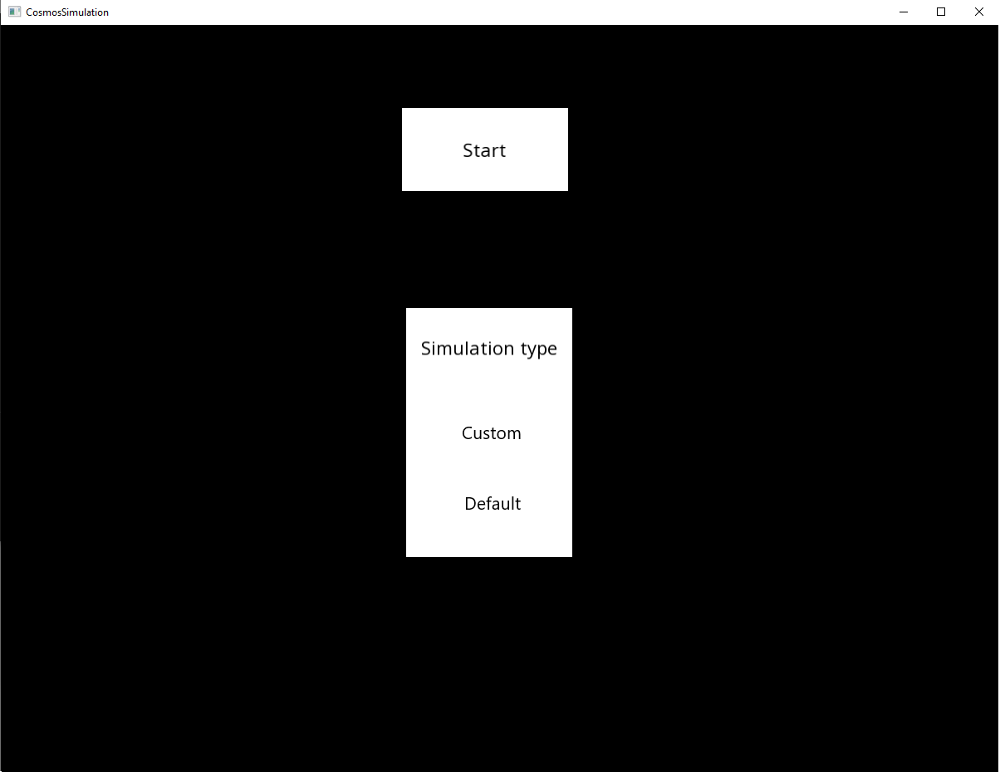
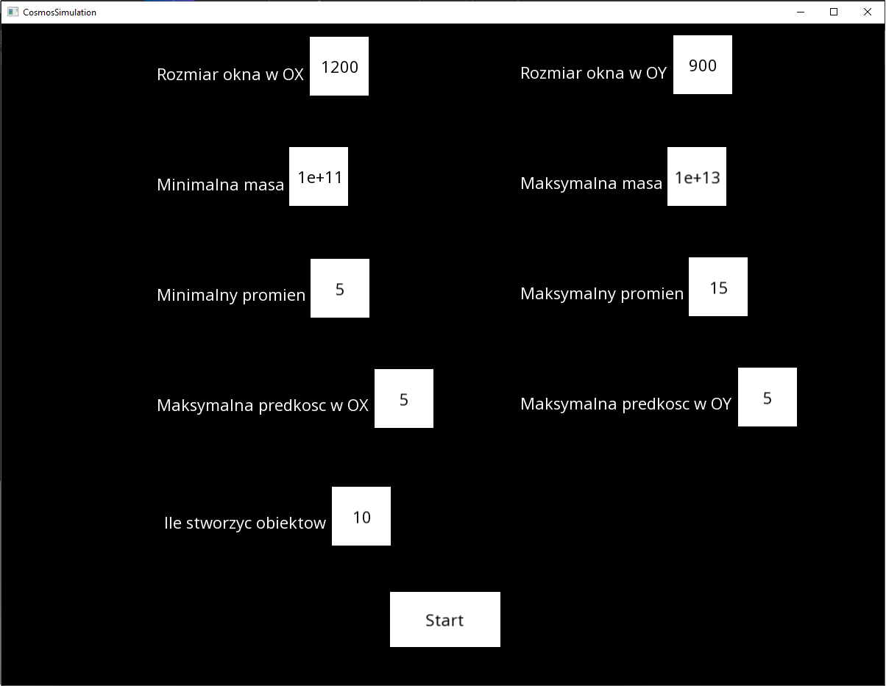
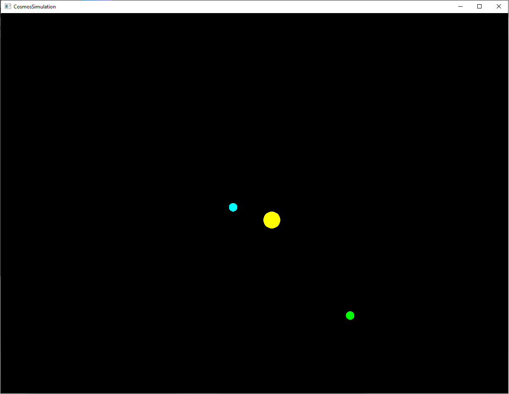

# Symulator ruchu planet (10.2020)
Graficzna symulacja 2D ruchu planet.

## Wymagania funkcjonalne:
* Uruchomienie domyślnej symulacji,
* Wybranie parametrów dla niestandardowej symulacji np. minimalna i maksymalna masa planet oraz liczba obiektów.

## Technologie:
* Główny język - C++,
* GUI - SFML (biblioteka graficzna języka C++).

## Zrzuty ekranu:

Główny widok aplikacji:

    

Wybór typu symulacji:

    

Wybór parametrów dla niestandardowej symulacji:

    

Widok symulacji:

    

